# QuestFlag Communication Platform -- Architecture & Requirements (v15)

**Version:** 15.0  
**Date:** 2026-03-01  

## Document Overview
This document provides a comprehensive and detailed architectural breakdown of the QuestFlag Communication Module. It includes elaborate state diagrams, sequence diagrams, activity diagrams, block diagrams, and configuration tables to define the system's behavior and structure.

## Table of Contents
## Table of Contents
1. [Core Communication Flow](#1-core-communication-flow)
2. [Conversation Management](#2-conversation-management)
3. [Real-Time Media Pipelines (Voice & Video)](#3-real-time-media-pipelines-voice--video)
4. [Infrastructure & Buffering](#4-infrastructure--buffering)
5. [Database Architecture & Schemas](#5-database-architecture--schemas)
6. [Project Folder Structure & Dependencies](#6-project-folder-structure--dependencies)

---

## 1. Core Communication Flow

### 1.1 Generic Communication Lifecycle (State Diagram)
**Overview:** Tracks the lifecycle of an outbound generic message (SMS, Email, Push) from creation to final delivery status.

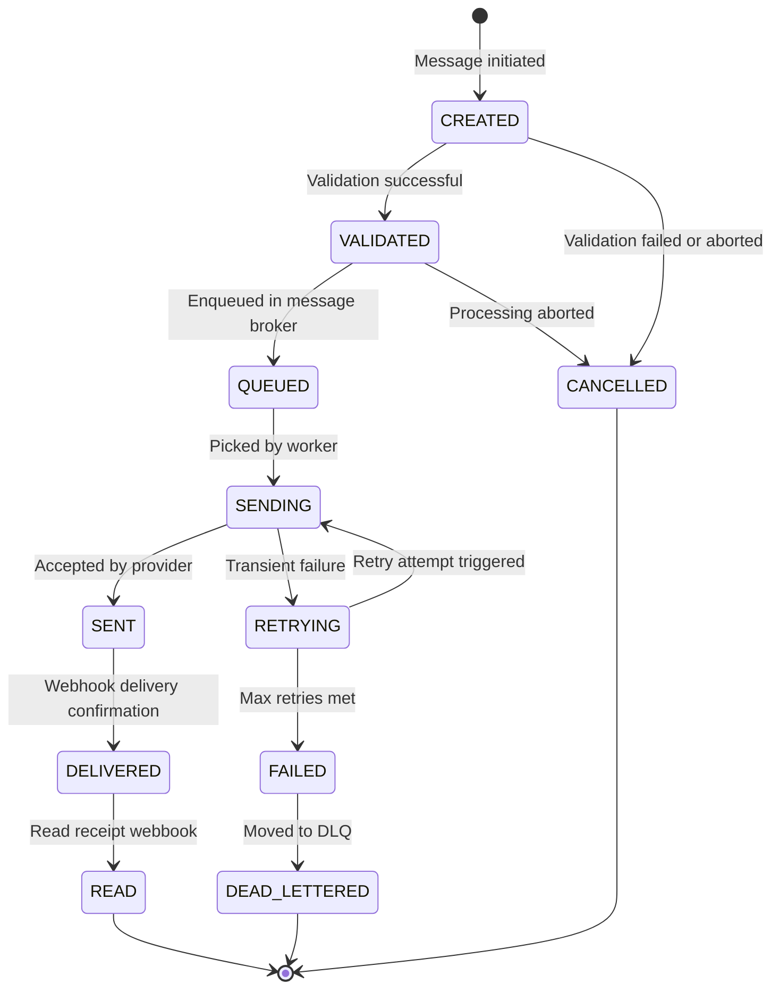

**Configuration Parameters:**
| Parameter | Type | Default | Description |
|-----------|------|---------|-------------|
| `COMM_MAX_RETRIES` | Integer | `3` | Maximum retry attempts for transient sending failures. |
| `COMM_RETRY_DELAY_MS`| Integer | `5000` | Delay between retry attempts. |
| `COMM_ENABLE_DLQ` | Boolean | `true` | Enables moving failed messages to a Dead Letter Queue. |

### 1.2 Generic Communication Flow (Sequence Diagram)
**Overview:** Describes the step-by-step procedure of an agent initiating a communication request, being validated, queued, and dispatched via external providers.

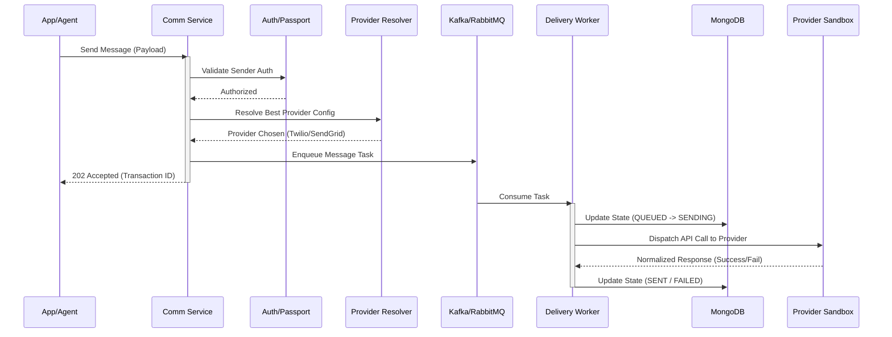

**Configuration Parameters:**
| Parameter | Type | Default | Description |
|-----------|------|---------|-------------|
| `RESOLVER_STRATEGY`| String | `COST` | Strategy for provider routing (COST, SPEED, RELIABILITY). |
| `QUEUE_MAX_BATCH` | Integer | `100` | Number of tasks pulled per worker iteration. |
| `AUTH_CACHE_TTL` | Integer | `3600` | Passport token cache expiry in seconds. |

### 1.3 Generic Communication Processing (Activity Diagram)
**Overview:** A top-level algorithmic flow for processing outbound communication logic within the orchestration layer.

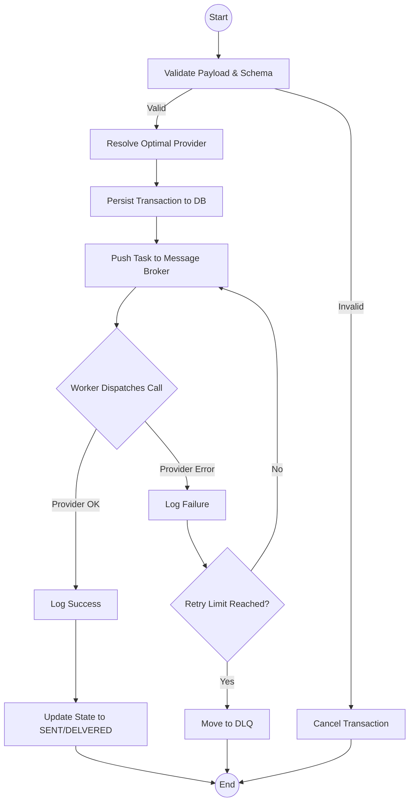

**Configuration Parameters:**
| Parameter | Type | Default | Description |
|-----------|------|---------|-------------|
| `VALIDATION_SCHEMA`| String | `v2.0` | Schema version to apply. |
| `DLQ_TOPIC` | String | `qf-dlq` | Kafka topic or AMQP queue name for dead letters. |

### 1.4 Generic Communication Pipeline (Block Diagram)
**Overview:** Illustrates the microservices components and logical network segregation involved in transmitting messages asynchronously.

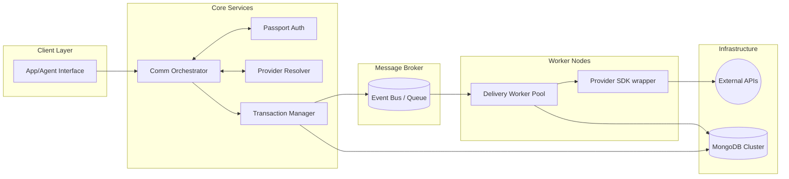

**Configuration Parameters:**
| Parameter | Type | Default | Description |
|-----------|------|---------|-------------|
| `WORKER_POOL_SIZE` | Integer | `10` | Number of instances processing the outbound queues. |
| `BROKER_URL` | String | `kafka:9092`| Broker endpoints configuration. |

---

## 2. Conversation Management

### 2.1 Conversation Lifecycle (State Diagram)
**Overview:** Conversations represent a bidirectional exchange of messages. This lifecycle manages the active status, waiting periods, and archival of conversational thread segments.

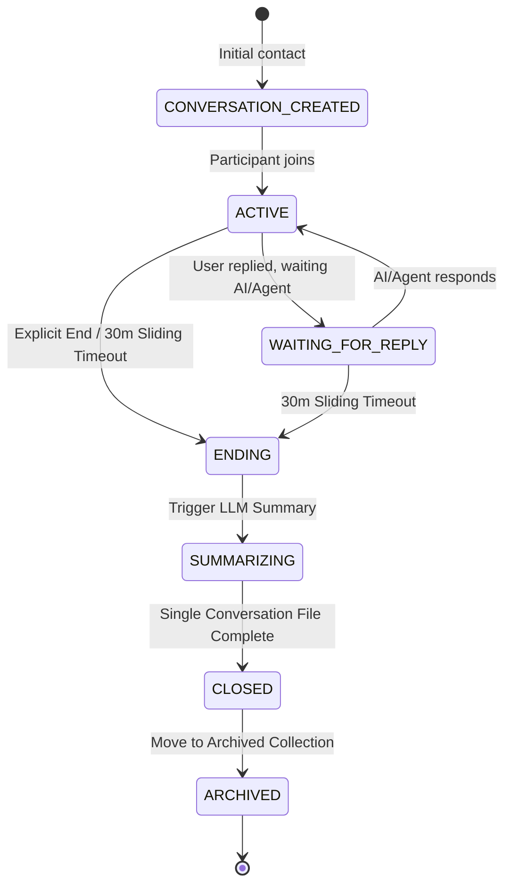

**Configuration Parameters:**
| Parameter | Type | Default | Description |
|-----------|------|---------|-------------|
| `CONV_TIMEOUT_MINS` | Integer | `30` | Sliding window of inactivity before marking as ENDING. |
| `CONV_ENABLE_LLM_SUMMARY`| Boolean | `true` | Extract facts, numbers, and summarize thread on closure. |
| `DB_COLL_ACTIVE_CONV` | String | `threads_active` | MongoDB collection for in-progress threads. |
| `DB_COLL_ARCHIVED_CONV` | String | `threads_archived`| MongoDB collection for single compiled threads. |

### 2.2 Conversation Flow (Sequence Diagram)
**Overview:** Handles inbound messages webhook from a provider, maintaining contextual threads and triggering automated responses.

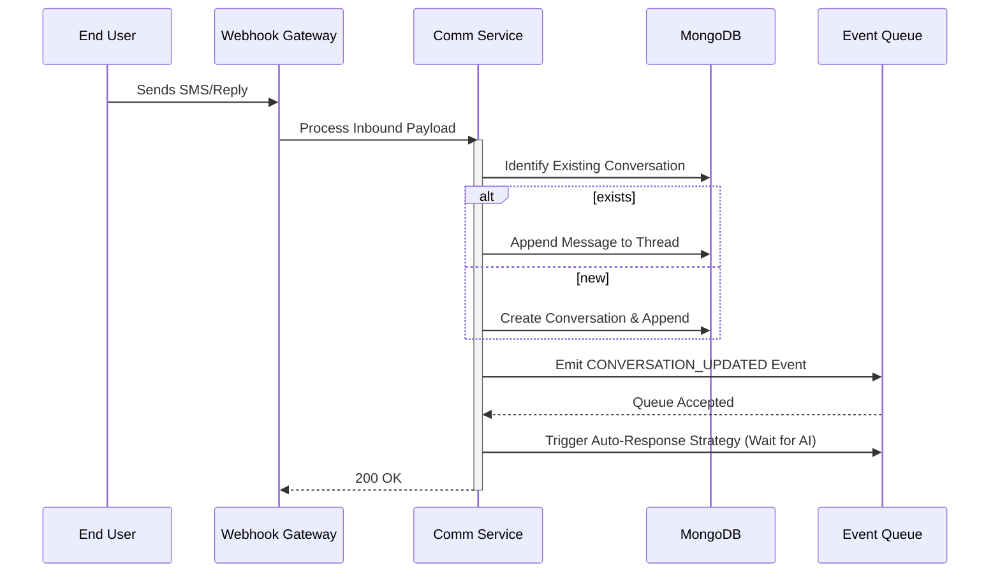

**Configuration Parameters:**
| Parameter | Type | Default | Description |
|-----------|------|---------|-------------|
| `WEBHOOK_AUTH_REQ` | Boolean | `true` | Verify signature of inbound webhook payloads. |
| `CONV_MAX_HISTORY` | Integer | `50` | Max messages to retrieve for AI context per thread. |

### 2.3 Conversation Handling (Activity Diagram)
**Overview:** Flow chart describing the triage of incoming user responses and mapping them to their corresponding logical threads.

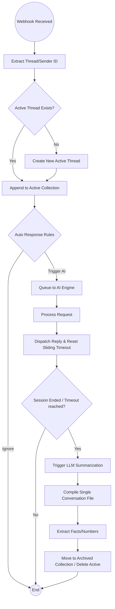

**Configuration Parameters:**
| Parameter | Type | Default | Description |
|-----------|------|---------|-------------|
| `AUTO_REPLY_ENABLED`| Boolean | `true` | Process conversational AI responses automatically. |
| `IGNORE_SPAM` | Boolean | `true` | Apply rudimentary spam filtering before processing. |

---

## 3. Real-Time Media Pipelines (Voice & Video)

### 3.1 Voice & Video Session Lifecycle (State Diagram)
**Overview:** Manages real-time WebRTC or WebSocket-based voice and video streams. Detailed connection state monitoring is required for handling network fluctuations.

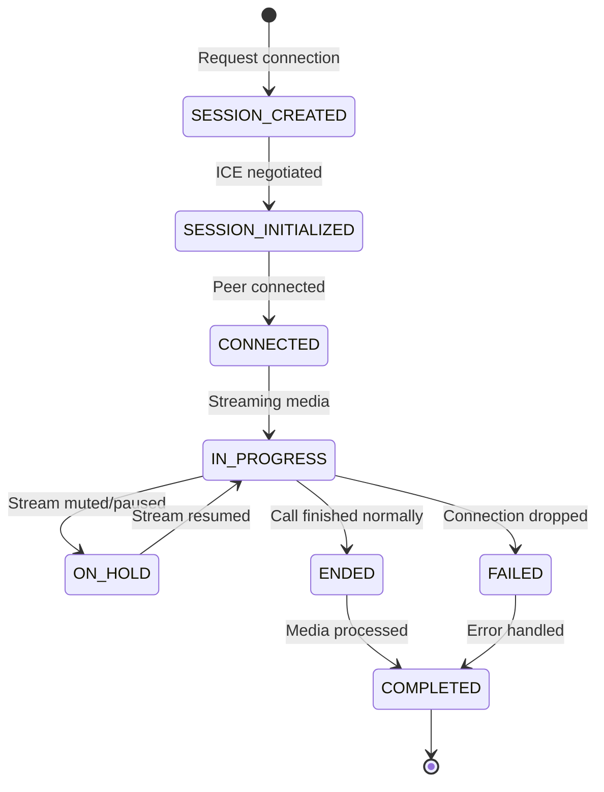

**Configuration Parameters:**
| Parameter | Type | Default | Description |
|-----------|------|---------|-------------|
| `RTC_ICE_TIMEOUT_MS` | Integer | `10000` | Timeout for ICE candidate gathering negotiation. |
| `RTC_PING_INTERVAL` | Integer | `5000` | Websocket/RTC keep-alive ping interval. |
| `RTC_HOLD_TIMEOUT` | Integer | `300` | Seconds before forcefully ending an ON_HOLD session. |

### 3.2 Streaming Pipeline Lifecycle (State Diagram)
**Overview:** Real-time AI voice interaction requires breaking down continuous audio streams into detectable sentences, processing them through STT/AI/TTS, and streaming back audio.

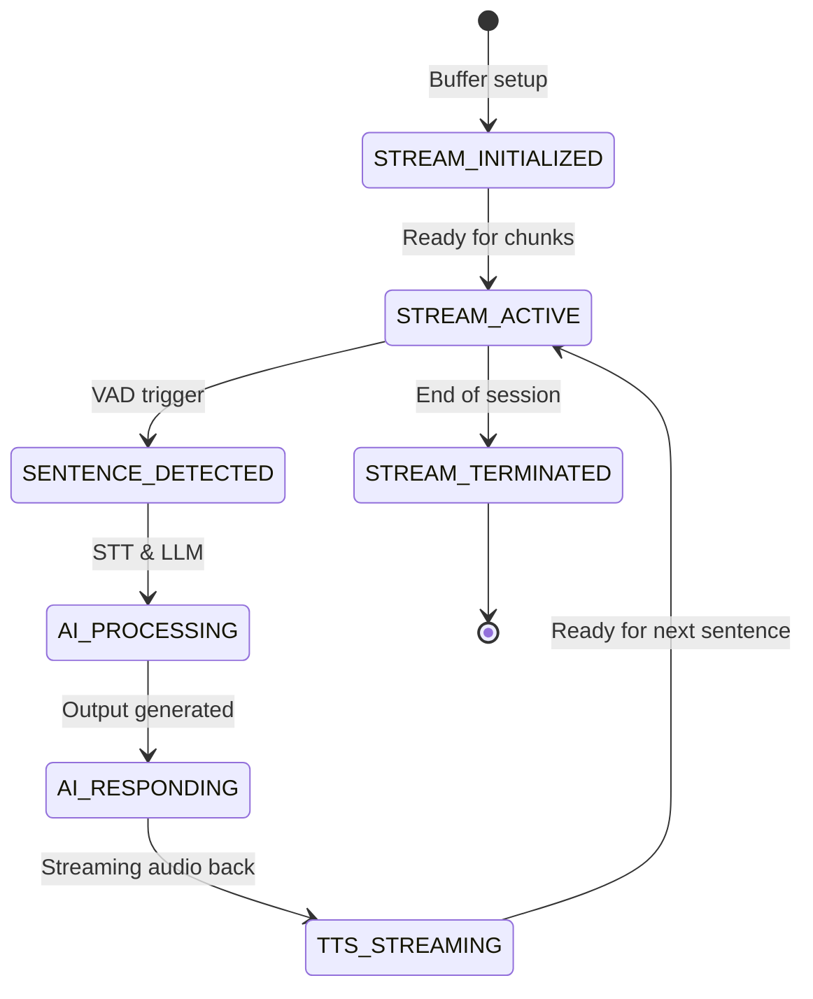

**Configuration Parameters:**
| Parameter | Type | Default | Description |
|-----------|------|---------|-------------|
| `VAD_SILENCE_THRES`| Integer | `500` | Milliseconds of silence to trigger sentence bound. |
| `STREAM_CHUNK_SIZE`| Integer | `4096` | Byte size for streaming audio chunk buffering. |
| `AI_RESPONSE_TIMEOUT`|Integer| `3000` | Global timeout for AI stream generation to prevent lag. |

### 3.3 Voice Pipeline Flow (Sequence Diagram)
**Overview:** A low-latency real-time processing pipeline specifically for full-duplex conversational AI voice interactions.

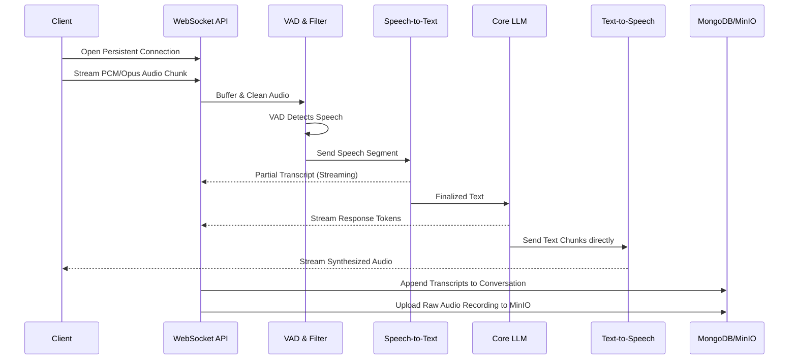

**Configuration Parameters:**
| Parameter | Type | Default | Description |
|-----------|------|---------|-------------|
| `VOICE_CODEC` | String | `opus` | Expected incoming audio codec. |
| `STT_LANGUAGE` | String | `en-US` | Default language for transcription. |
| `TTS_VOICE_ID` | String | `nova` | Voice persona configuration. |

### 3.4 Voice Pipeline Architecture (Block Diagram)
**Overview:** Details the exact buffer chains and processing memory structures used to handle streamed voice packets without disk I/O latency.

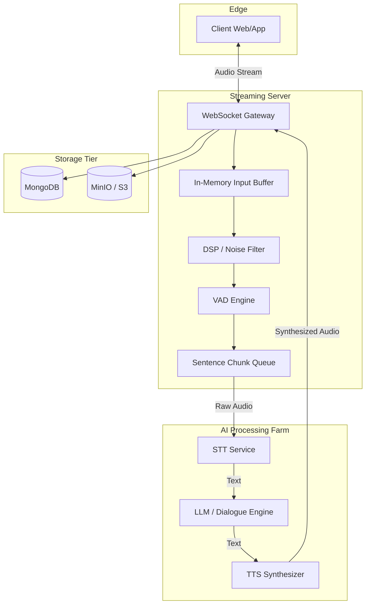

**Configuration Parameters:**
| Parameter | Type | Default | Description |
|-----------|------|---------|-------------|
| `DSP_NOISE_REDUCE`| Boolean | `true` | Enable internal DSP filtering before STT. |
| `BUFFER_POOL_MB` | Integer | `512` | Max RAM allocated for in-memory buffer pool per node. |

### 3.5 Video Pipeline Flow (Sequence Diagram)
**Overview:** A heavy-duty pipeline managing simultaneous audio-video streams, focusing on asynchronous sentiment analysis on video frames alongside standard real-time voice processing.

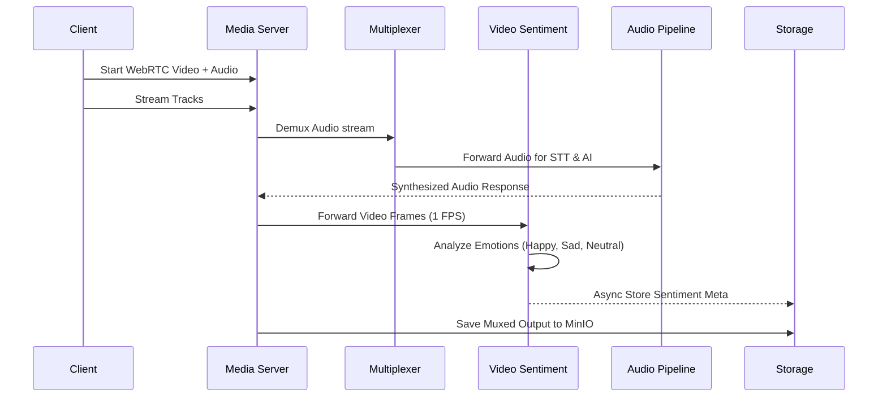

**Configuration Parameters:**
| Parameter | Type | Default | Description |
|-----------|------|---------|-------------|
| `VIDEO_FRAMERATE` | Integer | `30` | Inbound expected framerate. |
| `SENTIMENT_FPS` | Integer | `1` | Frames per second extracted for ML emotion tracking. |
| `STORAGE_BUCKET` | String | `qf-media`| MinIO storage bucket name. |

### 3.6 Video Pipeline Architecture (Block Diagram)
**Overview:** Illustrates concurrent processing tracks used when video streaming is active, splitting workloads between media processing, semantic NLP, and ML image inspection.

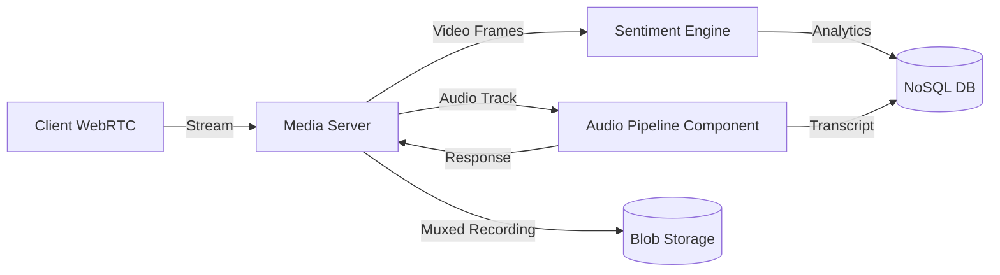

**Configuration Parameters:**
| Parameter | Type | Default | Description |
|-----------|------|---------|-------------|
| `VIDEO_BITRATE` | Integer | `1500000` | Target transcoding bitrate (bps). |
| `ENABLE_RECORDING`| Boolean | `true` | Save media feeds automatically to blob storage. |

---

## 4. Infrastructure & Buffering

### 4.1 Queue & Buffer Architecture (Block Diagram)
**Overview:** Focuses strictly on the specialized data structures utilized to handle real-time streaming constraints in the voice module, ensuring backpressure limits are respected.

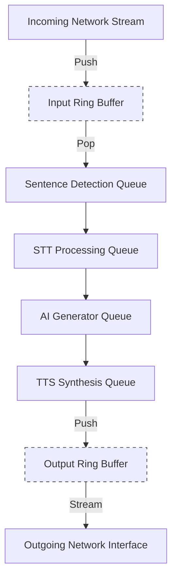

**Configuration Parameters:**
| Parameter | Type | Default | Description |
|-----------|------|---------|-------------|
| `RING_BUFFER_SIZE`| Integer | `16384` | Bytes per pre-allocated ring buffer. |
| `QUEUE_TIMEOUT_MS`| Integer | `10000` | How long an item can sit in a queue before dropping. |
| `ENABLE_BACKPRESSURE`| Boolean| `true` | Send rate-limiting events to clients when buffers fill. |

---

## 5. Database Architecture & Schemas

### 5.1 Final Database Architecture (Block Diagram)
**Overview:** This diagram visualizes the high-level storage interaction between the communication orchestrator, the conversational AI layers, and the persistent storage (MongoDB for state/metadata and Vector DB for semantic search and summaries).

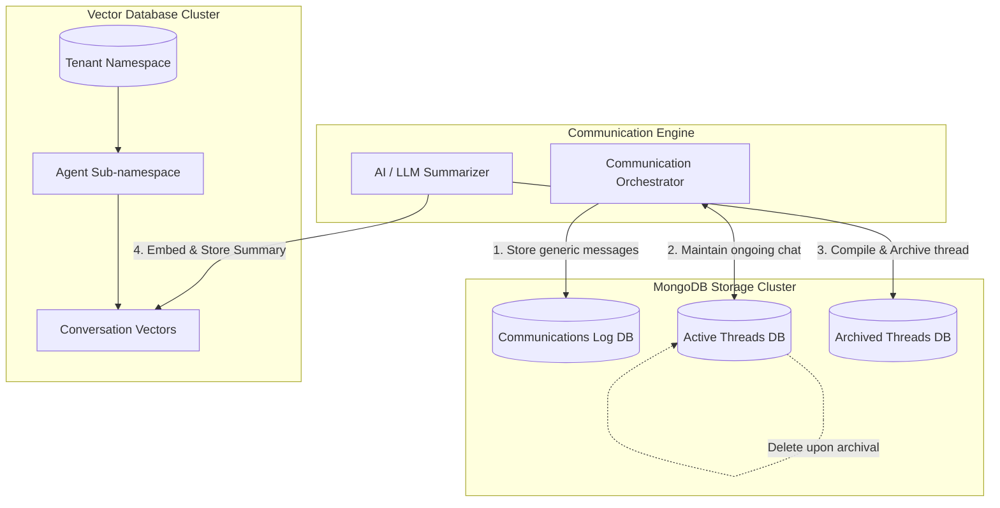

### 5.2 MongoDB Schema definitions
**Overview:** Details the physical collection structures inside MongoDB. Distinct collections are utilized to isolate short-lived active data from long-term archival and generic communications.

#### Schema: `communications_log` (Collection)
Stores all generic, one-way outbound or inbound communications (e.g. OTPs, marketing blasts) separately from dynamic conversational threads.
```json
{
  "_id": "ObjectId",
  "transaction_id": "String",
  "recipient": "String",
  "status": "String (SENT, DELIVERED, FAILED)",
  "channel_used": "String (SMS, EMAIL, WHATSAPP, PUSH)",
  "provider_id": "String (twilio-01, sendgrid-main)",
  "payload": "Object",
  "created_at": "Timestamp",
  "updated_at": "Timestamp"
}
```

#### Schema: `threads_active` & `threads_archived` (Collections)
Stores bi-directional conversational contexts. Active threads live in `threads_active`; upon closure and summarization, they are migrated to `threads_archived`.
```json
{
  "_id": "ObjectId",
  "tenant_id": "String",
  "agent_id": "String",
  "status": "String (ACTIVE, CLOSED, ARCHIVED)",
  "channel_used": "String (WEB, VOICE, VIDEO, SMS)",
  "provider_id": "String (qf-internal, twilio, zoom)",
  "messages": [
    {
      "sender": "String",
      "content": "String",
      "timestamp": "Timestamp"
    }
  ],
  "analytics": {
    "dominant_sentiment": "String (Positive, Neutral, Negative)",
    "sentiment_percentage": "Float (e.g. 87.5)",
    "extracted_facts": ["String"],
    "extracted_numbers": ["Number"]
  },
  "created_at": "Timestamp",
  "closed_at": "Timestamp"
}
```

### 5.3 Vector DB Hierarchical Structure
**Overview:** Detailed breakdown of the specialized folder/namespace hierarchy utilized to inject semantic, search-ready embeddings of compiled conversation summaries.

**Hierarchy Routing:** `/{Tenant_ID}/{Agent_ID}/{Conversation_ID}`

```json
{
  "namespace": "tenant_a4b9c",
  "metadata": {
    "agent_name": "Sales_Bot_01",
    "agent_id": "agt_99x",
    "conversation_id": "conv_8841abc",
    "channel_used": "VOICE"
  },
  "vectors": [
    {
      "id": "summary_chunk_1",
      "values": [0.12, 0.44, -0.65, ...], 
      "metadata": {
        "text": "User agreed to purchase the enterprise tier after discussing compliance requirements.",
        "fact_type": "decision"
      }
    }
  ]
}
```

**Configuration Parameters:**
| Parameter | Type | Default | Description |
|-----------|------|---------|-------------|
| `MONGO_COMM_COLLECTION`| String | `communications_log` | Collection isolated for stateless/generic messages. |
| `VECTOR_DIMENSIONS` | Integer | `1536` | Embedding vector size (e.g. for OpenAI `text-embedding-ada-002`). |
| `DB_SENTIMENT_TRACK` | Boolean | `true` | Aggregate dominant sentiment and percentage upon archiving. |

### 5.4 Database Entity-Relationship (ER) Diagrams

**Overview:** Below are the Entity-Relationship models defining the logical data structures and relationships for PostgreSQL (core relations/configuration), MongoDB (document storage), and Vector DB (hierarchical semantic storage).

#### 1. PostgreSQL ER Diagram (Core Relations)
Manages the structured relational data including tenants, agents, users, and provider configurations.
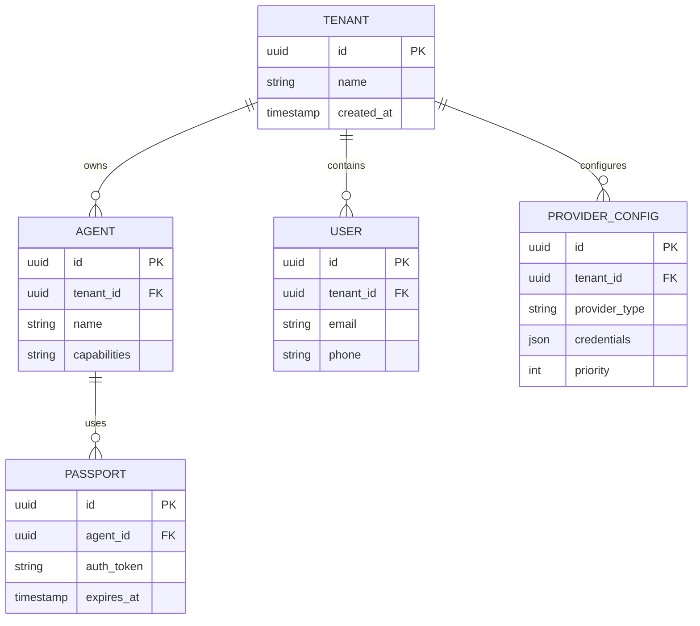

#### 2. MongoDB Logical ER Diagram (Document Storage)
Illustrates how the document-based collections (`communications_log`, `threads_active`, `threads_archived`) logically relate to their embedded nested objects (`messages` and `analytics`).
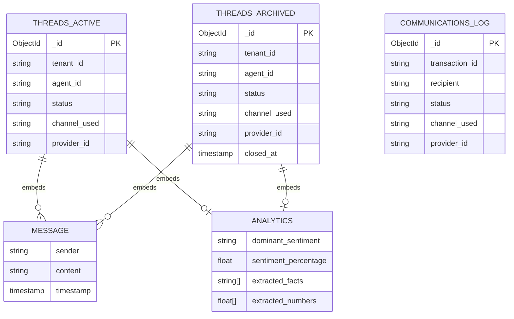

#### 3. Vector DB Logical ER Diagram (Hierarchical Namespaces)
Details the namespace routing logic leading down to individual vector chunks containing spatial float arrays and semantic metadata.
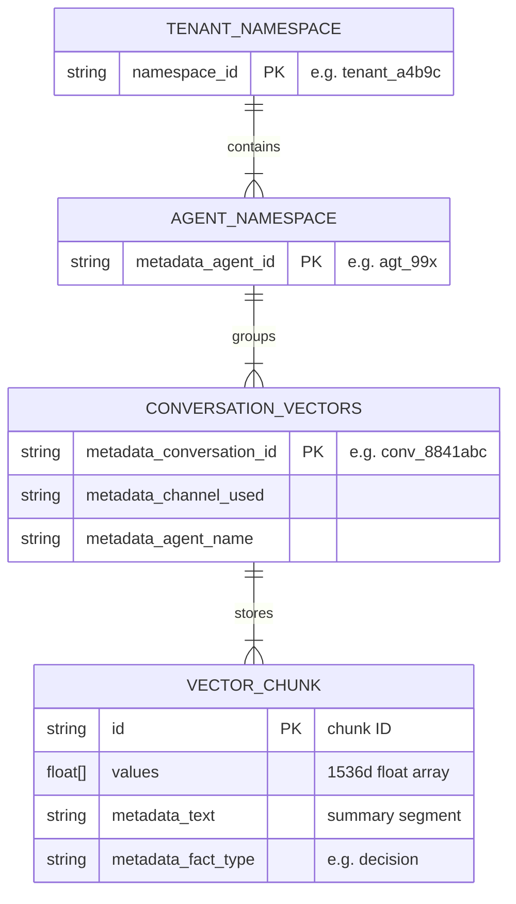

---

## 6. Project Folder Structure & Dependencies

### 6.1 Communication Module Folder Structure
To maintain Clean Architecture consistency with the `Passport` and `Infrastructure` modules, the `Communication` module will implement the following `.csproj` boundaries inside the `src/Communication` directory:

```text
src/
└── Communication/
    ├── QuestFlag.Communication.ApiCore     (API Controllers, HTTP Routing logic)
    ├── QuestFlag.Communication.Application (Use Cases, CQRS Handlers, Validation)
    ├── QuestFlag.Communication.Client      (HTTP/gRPC SDK for other microservices)
    ├── QuestFlag.Communication.Core        (Data Access, EF Core, Mongo/Vector implementations)
    ├── QuestFlag.Communication.Domain      (Entities, Interfaces, Enums, Exceptions)
    ├── QuestFlag.Communication.Services    (Executable API/Worker Host, Dependency Injection)
    └── QuestFlag.Communication.WebApp      (Optional: UI for agent dashboard)
```

### 6.2 Cross-Project Updates Required

#### Updates to `Passport` Project
The Authentication module will occasionally need to trigger transactional messages (e.g., OTPs, Welcome Emails, Password Resets).
1. Add a direct project reference to `QuestFlag.Communication.Client` within `QuestFlag.Passport.Core` or `QuestFlag.Passport.Services`.
2. Ensure `Passport` emits `UserCreated` or `OtpRequested` events onto the Message Broker (Kafka/RabbitMQ) so that the `Communication` workers can trigger these emails asynchronously without tightly coupling HTTP requests.

#### Updates to `Infrastructure` Project
The Core Infrastructure serves shared connections and utilities.
1. Ensure the shared Message Broker configurations in `QuestFlag.Infrastructure.Core` are updated to support the new `qf-communication-tasks` and `qf-dlq` topics.
2. Ensure standard provider SDKs (Twilio, SendGrid) configurations or HttpClient wrappers can be injected easily via the `QuestFlag.Infrastructure.Services` DI container, or strictly scoped to the `Communication` module if preferred.

### 6.3 Internal Dependencies & External Packages Breakdown

Below details exactly which sub-projects reference which dependencies:

#### 1. `QuestFlag.Communication.Domain`
* **Internal Refs**: None. This is the innermost ring.
* **External Packages**: None (Pure C# models).

#### 2. `QuestFlag.Communication.Application`
* **Internal Refs**: `QuestFlag.Communication.Domain`
* **External Packages**: 
  - `MediatR` (CQRS pattern)
  - `FluentValidation.DependencyInjectionExtensions`

#### 3. `QuestFlag.Communication.Core`
* **Internal Refs**: `QuestFlag.Communication.Domain`, `QuestFlag.Communication.Application`
* **External Packages**: 
  - `Microsoft.EntityFrameworkCore` & `Npgsql.EntityFrameworkCore.PostgreSQL` (Relational data)
  - `MongoDB.Driver` (Document storage for logs and threads)
  - Vector DB SDK (e.g. `Pinecone.NET` or `Qdrant.Client`)
  - AI SDKs (e.g. `Azure.AI.OpenAI` or similar for Summarizations / Embeddings)

#### 4. `QuestFlag.Communication.ApiCore`
* **Internal Refs**: `QuestFlag.Communication.Domain`, `QuestFlag.Communication.Application`
* **External Packages**: 
  - `Microsoft.AspNetCore.Mvc.Core`

#### 5. `QuestFlag.Communication.Client`
* **Internal Refs**: `QuestFlag.Communication.Domain` (For sharing DTOs/Contracts)
* **External Packages**: 
  - `System.Net.Http.Json`

#### 6. `QuestFlag.Communication.Services` (The Host application)
* **Internal Refs**: `QuestFlag.Communication.ApiCore`, `QuestFlag.Communication.Application`, `QuestFlag.Communication.Core`, `QuestFlag.Infrastructure.Client`
* **External Packages**: 
  - `Microsoft.AspNetCore.Authentication.JwtBearer`
  - `Swashbuckle.AspNetCore`
  - `Microsoft.EntityFrameworkCore.Tools` / `Design`
