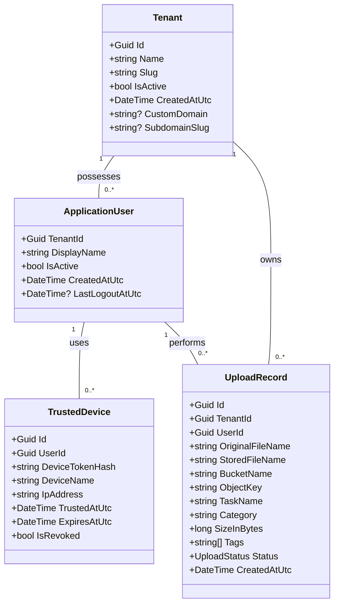

# Class Diagram

This diagram show the relationships between core domain entities in the QuestFlag and Passport solutions.

## Description of Relationships

- **Tenant to ApplicationUser**: A multi-tenant system where each user belongs to exactly one tenant.
- **ApplicationUser to TrustedDevice**: A user can have multiple trusted devices for bypassing 2FA.
- **Tenant/User to UploadRecord**: Each file upload is associated with a specific user and their tenant for isolation and billing.
