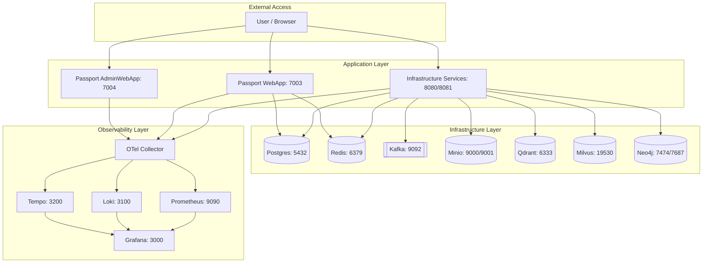

# Deployment Documentation

This document describes the deployment architecture and service configuration for the QuestFlag solution.

## Deployment Architecture

## Service Details

The following table lists the infrastructure services used in the solution, including their URLs and default credentials as configured in the development environment.

| Service | Local URL | Port | Username | Password |
| :--- | :--- | :--- | :--- | :--- |
| **PostgreSQL** | `localhost:5432` | 5432 | `postgres` | `P@ssw0rd!Qf2026!` |
| **Redis** | `localhost:6379` | 6379 | - | - |
| **Kafka** | `localhost:9092` | 9092 | - | - |
| **Minio (API)** | `localhost:9000` | 9000 | `admin` | `m1n10!$tr0ngP@ss!` |
| **Minio (Console)** | `localhost:9001` | 9001 | `admin` | `m1n10!$tr0ngP@ss!` |
| **Neo4j (HTTP)** | `localhost:7474` | 7474 | `neo4j` | `N3o4j!$tr0ngP@ss!` |
| **Neo4j (Bolt)** | `localhost:7687` | 7687 | `neo4j` | `N3o4j!$tr0ngP@ss!` |
| **Qdrant** | `localhost:6333` | 6333/6334 | - | - |
| **Milvus** | `localhost:19530` | 19530 | - | - |
| **Grafana** | `localhost:3000` | 3000 | `admin` | `gr@fan@!$tr0ngP@ss!` |
| **Prometheus** | `localhost:9090` | 9090 | - | - |
| **Loki** | `localhost:3100` | 3100 | - | - |
| **Tempo** | `localhost:3200` | 3200 | - | - |

> [!NOTE]
> These credentials are for the development environment (`docker-compose.override.yml`) and should be changed for production deployments.
