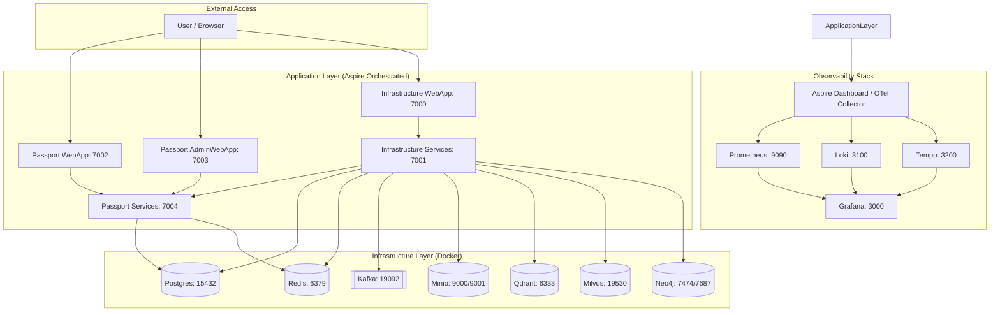

# Deployment Documentation

This document describes the deployment architecture and service configuration for the QuestFlag solution.

## Deployment Architecture

The system uses **.NET Aspire** for local orchestration, managing both the application services and the shared infrastructure.

```mermaid
graph TD
    subgraph "External Access"
        UA[User / Browser]
    end

    subgraph "Application Layer (Aspire Orchestrated)"
        PWA[Passport WebApp: 7002]
        PAWA[Passport AdminWebApp: 7003]
        PS[Passport Services: 7004]
        IWA[Infrastructure WebApp: 7000]
        IS[Infrastructure Services: 7001]
    end

    subgraph "Infrastructure Layer (Docker)"
        PG[(Postgres: 15432)]
        RD[(Redis: 6379)]
        KF[[Kafka: 19092]]
        MN[(Minio: 9000/9001)]
        QD[(Qdrant: 6333)]
        MV[(Milvus: 19530)]
        NJ[(Neo4j: 7474/7687)]
    end

    subgraph "Observability Stack"
        OTEL[Aspire Dashboard / OTel Collector]
        PROM[Prometheus: 9090]
        GF[Grafana: 3000]
        LK[Loki: 3100]
        TM[Tempo: 3200]
    end

    UA --> PWA
    UA --> PAWA
    UA --> IWA
    
    IWA --> IS
    IS --> PS
    PAWA --> PS
    PWA --> PS
    
    IS --> PG
    IS --> RD
    IS --> KF
    IS --> MN
    IS --> QD
    IS --> MV
    IS --> NJ

    PS --> PG
    PS --> RD

    ApplicationLayer --> OTEL
    OTEL --> PROM
    OTEL --> LK
    OTEL --> TM
    PROM --> GF
    LK --> GF
    TM --> GF
```

## Service Details (Local Development)

The following table lists the default port mappings and credentials as configured in the Aspire AppHost and Docker Compose.

| Service | Local URL | Port | Username | Password |
| :--- | :--- | :--- | :--- | :--- |
| **Passport WebApp** | `https://localhost:7002` | 7002 | - | - |
| **Passport Admin** | `https://localhost:7003` | 7003 | - | - |
| **Passport Services**| `https://localhost:7004` | 7004 | - | - |
| **Infra WebApp** | `https://localhost:7000` | 7000 | - | - |
| **Infra Services** | `https://localhost:7001` | 7001 | - | - |
| **PostgreSQL** | `localhost:15432` | 15432 | `postgres` | `P@ssw0rd!Qf2026!` |
| **Redis** | `localhost:6379` | 6379 | - | - |
| **Kafka (Broker)** | `localhost:19092` | 19092 | - | - |
| **Minio (API)** | `localhost:9000` | 9000 | `admin` | `m1n10!$tr0ngP@ss!` |
| **Minio (Console)** | `localhost:9001` | 9001 | `admin` | `m1n10!$tr0ngP@ss!` |
| **Neo4j (HTTP)** | `localhost:7474` | 7474 | `neo4j` | `N3o4j!$tr0ngP@ss!` |
| **Qdrant** | `localhost:6333` | 6333 | - | - |
| **Grafana** | `localhost:3000` | 3000 | `admin` | `gr@fan@!$tr0ngP@ss!` |

## Development Setup

1. **Prerequisites**: Docker Desktop, .NET 10 SDK, Aspire workload.
2. **Infrastructure**: Run `docker-compose up -d` in `src/Deployment` to start backing services.
3. **Application**: Run the `QuestFlag.AppHost` project to start all microservices and the Aspire dashboard.

> [!TIP]
> Use the Aspire Dashboard (accessible when running AppHost) to view structured logs, traces, and metrics across all services in real-time.
