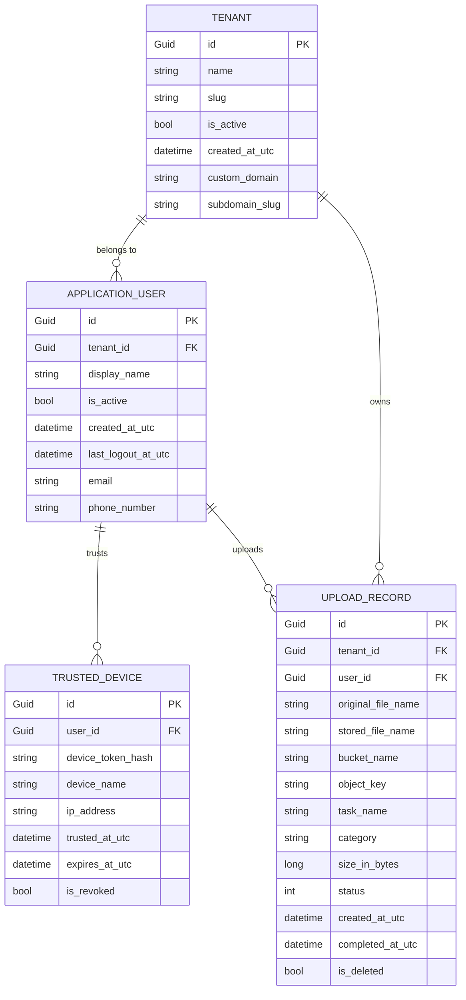

# Entity Relationship (ER) Diagram

This diagram show the database schema relationships for the QuestFlag solution.

## Schema Overview

- **TENANT**: The root of multi-tenancy. All data is partitioned by `tenant_id`.
- **APPLICATION_USER**: Extends the default Identity user, linked to a specific tenant.
- **TRUSTED_DEVICE**: Security feature for 2FA bypass.
- **UPLOAD_RECORD**: Tracks the lifecycle of uploaded files across the system.
