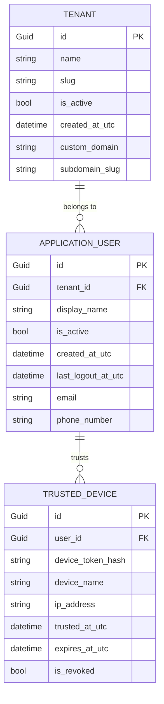
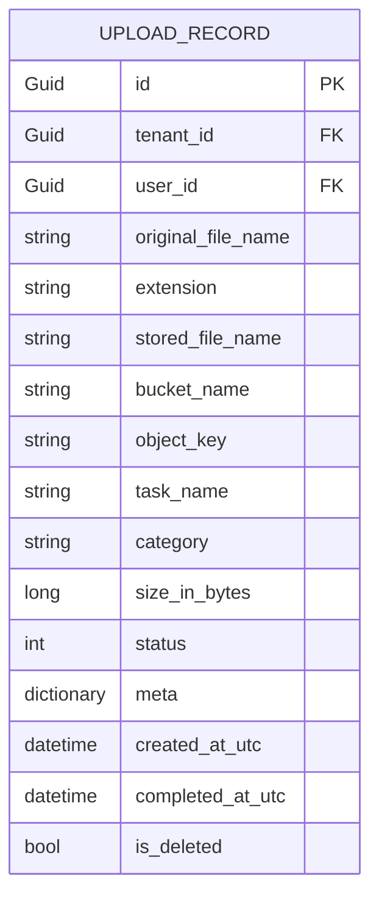

# Entity Relationship (ER) Diagrams

This document shows the database schema relationships for the QuestFlag solution. Because the system is partitioned into separate services, each uses its own independent database.

## Passport Database

The Passport database handles identity, multi-tenancy, authorization, and authentication.

```mermaid
erDiagram
    TENANT ||--o{ APPLICATION_USER : "belongs to"
    APPLICATION_USER ||--o{ TRUSTED_DEVICE : "trusts"

    TENANT {
        Guid id PK
        string name
        string slug
        bool is_active
        datetime created_at_utc
        string custom_domain
        string subdomain_slug
    }

    APPLICATION_USER {
        Guid id PK
        Guid tenant_id FK
        string display_name
        bool is_active
        datetime created_at_utc
        datetime last_logout_at_utc
        string email
        string phone_number
    }

    TRUSTED_DEVICE {
        Guid id PK
        Guid user_id FK
        string device_token_hash
        string device_name
        string ip_address
        datetime trusted_at_utc
        datetime expires_at_utc
        bool is_revoked
    }
```

## Infrastructure Database

The Infrastructure database handles domain-agnostic services, such as tracking file uploads. Note that the `tenant_id` and `user_id` fields are soft references to the Passport database, as EF Core does not enforce cross-database referential integrity.

```mermaid
erDiagram
    UPLOAD_RECORD {
        Guid id PK
        Guid tenant_id FK
        Guid user_id FK
        string original_file_name
        string extension
        string stored_file_name
        string bucket_name
        string object_key
        string task_name
        string category
        long size_in_bytes
        int status
        dictionary meta
        datetime created_at_utc
        datetime completed_at_utc
        bool is_deleted
    }
```

## Schema Overview

### Passport Database
- **TENANT**: The root of multi-tenancy. All business-level data is partitioned by `tenant_id`.
- **APPLICATION_USER**: Extends the default Identity user, linked to a specific tenant.
- **TRUSTED_DEVICE**: Security feature for 2FA bypass and persistent sessions.

### Infrastructure Database
- **UPLOAD_RECORD**: Tracks the lifecycle of uploaded files to S3/MinIO across the system. It references tenants and users from the Passport database via soft foreign keys.
  - **Extension & Meta**: The `extension` field stores the file type, and the `meta` dictionary stores arbitrary key-value metadata (mapped to `ExtraData` in code).
  - **Batch Management**: There is no dedicated `BATCH` table. Batches are logically grouped by assigning the exact same `task_name` and `category` to multiple `UPLOAD_RECORD` entries when executing batch uploads.
