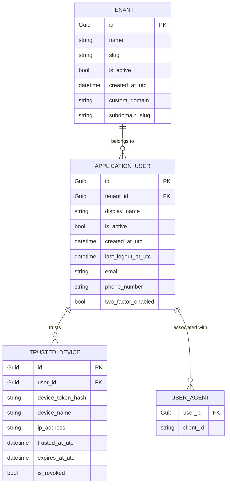
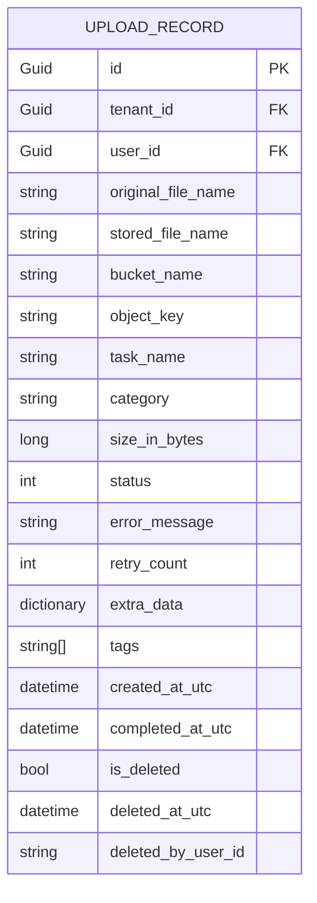

# Entity Relationship (ER) Diagrams

This document shows the database schema relationships for the QuestFlag solution. Because the system is partitioned into separate services, each uses its own independent database.

## Passport Database

The Passport database handles identity, multi-tenancy, authorization, and authentication.

```mermaid
erDiagram
    TENANT ||--o{ APPLICATION_USER : "belongs to"
    APPLICATION_USER ||--o{ TRUSTED_DEVICE : "trusts"
    APPLICATION_USER ||--o{ USER_AGENT : "associated with"

    TENANT {
        Guid id PK
        string name
        string slug
        bool is_active
        datetime created_at_utc
        string custom_domain
        string subdomain_slug
    }

    APPLICATION_USER {
        Guid id PK
        Guid tenant_id FK
        string display_name
        bool is_active
        datetime created_at_utc
        datetime last_logout_at_utc
        string email
        string phone_number
        bool two_factor_enabled
    }

    TRUSTED_DEVICE {
        Guid id PK
        Guid user_id FK
        string device_token_hash
        string device_name
        string ip_address
        datetime trusted_at_utc
        datetime expires_at_utc
        bool is_revoked
    }

    USER_AGENT {
        Guid user_id FK
        string client_id
    }
```

## Infrastructure Database

The Infrastructure database handles domain-agnostic services, such as tracking file uploads. Note that the `tenant_id` and `user_id` fields are soft references to the Passport database.

```mermaid
erDiagram
    UPLOAD_RECORD {
        Guid id PK
        Guid tenant_id FK
        Guid user_id FK
        string original_file_name
        string stored_file_name
        string bucket_name
        string object_key
        string task_name
        string category
        long size_in_bytes
        int status
        string error_message
        int retry_count
        dictionary extra_data
        string[] tags
        datetime created_at_utc
        datetime completed_at_utc
        bool is_deleted
        datetime deleted_at_utc
        string deleted_by_user_id
    }
```

## Schema Overview

### Passport Database
- **TENANT**: The root of multi-tenancy.
- **APPLICATION_USER**: Extends the default Identity user, linked to a specific tenant.
- **TRUSTED_DEVICE**: Security feature for 2FA bypass.
- **USER_AGENT**: Maps users to specific OIDC clients/agents.

### Infrastructure Database
- **UPLOAD_RECORD**: Tracks the lifecycle of uploaded files to S3/MinIO.
  - **extra_data**: Dictionary for arbitrary key-value metadata.
  - **retry_count & error_message**: Tracking for failed processing attempts.
  - **IsDeleted**: Support for soft deletion.
