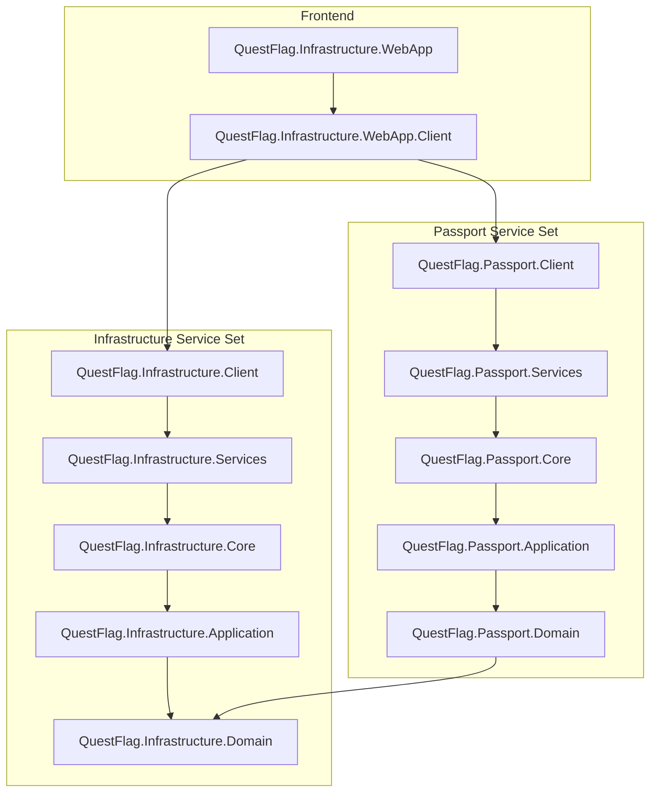

# Project Structure and Dependencies

This document provides an overview of the QuestFlag solution structure, project dependencies, and a detailed list of files with their descriptions.

## Project Dependency Graph

The solution follows Clean Architecture principles, with dependencies flowing towards the Domain layer.

## Project Structure and File Descriptions

### Infrastructure Service Set

#### QuestFlag.Infrastructure.Domain
*Core domain entities and repository interfaces.*
- `Entities/UploadRecord.cs`: Represents a file upload record with metadata and status.
- `Enums/UploadStatus.cs`: Enumeration of upload states (Pending, Processing, Completed, Failed).
- `Interfaces/IUploadRepository.cs`: Definition for upload data access.

#### QuestFlag.Infrastructure.Application
*Business rules and use cases.*
- `Commands/UploadFileCommand.cs`: Command for initiating a file upload.
- `Queries/GetUploadsQuery.cs`: Query for retrieving list of uploads.
- `Validators/UploadFileValidator.cs`: Validation logic for file uploads.

#### QuestFlag.Infrastructure.Core
*Data access and external service implementations.*
- `Data/AppDbContext.cs`: Entity Framework Core database context.
- `Storage/MinioStorageService.cs`: Implementation for Minio object storage.
- `Messaging/KafkaUploadEventPublisher.cs`: Kafka producer for upload events.

#### QuestFlag.Infrastructure.Services
*API Hosting and Middleware.*
- `Controllers/UploadController.cs`: REST API endpoints for upload operations.
- `Program.cs`: Entry point and service configuration.

### Passport Service Set

#### QuestFlag.Passport.Domain
*Identity and Tenant domain entities.*
- `Entities/Tenant.cs`: Represents a multi-tenant organization.
- `Entities/ApplicationUser.cs`: Extended Identity user with tenant association.
- `Entities/TrustedDevice.cs`: Records devices trusted after 2FA.

#### QuestFlag.Passport.Application
*Authentication and Authorization use cases.*
- `Commands/LoginCommand.cs`: Handles user authentication requests.
- `Queries/GetTenantsQuery.cs`: Retrieves tenant information.

#### QuestFlag.Passport.Core
*Identity and Passport data implementations.*
- `Data/PassportDbContext.cs`: DB context for identity and OpenIddict.
- `Repositories/TenantRepository.cs`: Implementation for tenant management.

#### QuestFlag.Passport.Services
*Authentication server and API.*
- `Controllers/AccountController.cs`: Endpoints for user account management.
- `Program.cs`: Configures OpenIddict and Identity services.

### Deployment
- `docker-compose.yml`: Main Docker orchestration file.
- `docker-compose.override.yml`: Development-specific overrides and service credentials.
- `QuestFlag.slnx`: Modern Solution File for the entire project.
