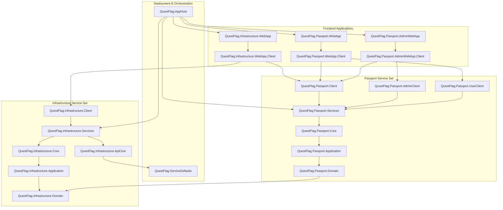

# Project Structure and Dependencies

This document provides an overview of the QuestFlag solution structure, project dependencies, and a detailed list of projects with their descriptions.

## Project Dependency Graph

The solution follows Clean Architecture principles, with dependencies flowing towards the Domain layer. Orchestration is handled by .NET Aspire.

```mermaid
graph TD
    subgraph "Deployment & Orchestration"
        AH[QuestFlag.AppHost]
        SD[QuestFlag.ServiceDefaults]
    end

    subgraph "Infrastructure Service Set"
        ID[QuestFlag.Infrastructure.Domain]
        IA[QuestFlag.Infrastructure.Application]
        IC[QuestFlag.Infrastructure.Core]
        IS[QuestFlag.Infrastructure.Services]
        ICL[QuestFlag.Infrastructure.Client]
        IAC[QuestFlag.Infrastructure.ApiCore]
        
        IA --> ID
        IC --> IA
        IS --> IC
        IS --> IAC
        ICL --> IS
        IAC --> SD
    end

    subgraph "Passport Service Set"
        PD[QuestFlag.Passport.Domain]
        PA[QuestFlag.Passport.Application]
        PC[QuestFlag.Passport.Core]
        PS[QuestFlag.Passport.Services]
        PCL[QuestFlag.Passport.Client]
        PACL[QuestFlag.Passport.AdminClient]
        PUCL[QuestFlag.Passport.UserClient]
        
        PA --> PD
        PC --> PA
        PS --> PC
        PCL --> PS
        PACL --> PS
        PUCL --> PS
        
        PD --> ID
    end

    subgraph "Frontend Applications"
        WA[QuestFlag.Infrastructure.WebApp]
        WAC[QuestFlag.Infrastructure.WebApp.Client]
        PWA[QuestFlag.Passport.WebApp]
        PWAC[QuestFlag.Passport.WebApp.Client]
        PAWA[QuestFlag.Passport.AdminWebApp]
        PAWAC[QuestFlag.Passport.AdminWebApp.Client]
        
        WA --> WAC
        WAC --> ICL
        WAC --> PCL
        
        PWA --> PWAC
        PWAC --> PCL
        PWAC --> PUCL
        
        PAWA --> PAWAC
        PAWAC --> PACL
        PAWAC --> PCL
    end

    AH --> IS
    AH --> PS
    AH --> WA
    AH --> PWA
    AH --> PAWA
```

## Project Structure and File Descriptions

### Deployment & Orchestration

#### QuestFlag.AppHost
- .NET Aspire orchestration project. Manages service lifecycle and environment variables.

#### QuestFlag.ServiceDefaults
- Common service configuration for OpenTelemetry, health checks, and service discovery.

### Infrastructure Service Set

#### QuestFlag.Infrastructure.Domain
*Core domain entities and repository interfaces.*
- `Entities/UploadRecord.cs`: Represents a file upload record.
- `Interfaces/IUploadRepository.cs`: Data access interface for uploads.

#### QuestFlag.Infrastructure.Application
*Business rules and use cases.*
- `Commands/`: Logic for creating or modifying data (e.g., `UploadFileCommand`).
- `Queries/`: Logic for retrieving data.
- `Repositories/`: Implementation of repository interfaces (recently moved from Core).

#### QuestFlag.Infrastructure.Core
*Data access and external service implementations.*
- `Data/AppDbContext.cs`: EF Core context for Infrastructure services.
- `Storage/`: Minio/Cloud storage implementations.
- `Messaging/`: Kafka producer/consumer implementations.

#### QuestFlag.Infrastructure.Services
*API Hosting.*
- `Controllers/`: REST API endpoints.
- `Program.cs`: Service entry point.

#### QuestFlag.Infrastructure.ApiCore
- Shared API components, middleware, and common DTOs.

#### QuestFlag.Infrastructure.Client
- Client SDK for communicating with Infrastructure services.

### Passport Service Set

#### QuestFlag.Passport.Domain
*Identity and Tenant domain entities.*
- `Entities/Tenant.cs`: Multi-tenant organization.
- `Entities/ApplicationUser.cs`: Extended Identity user.
- `Entities/UserAgent.cs`: Mapping between users and clients.

#### QuestFlag.Passport.Application
*Authentication and Authorization use cases.*
- `Commands/`: Login, Tenant management, User CRUD.
- `Queries/`: Retrieval of tenants, users, and roles.

#### QuestFlag.Passport.Core
*Identity and Passport data implementations.*
- `Data/PassportDbContext.cs`: Identity and OpenIddict context.

#### QuestFlag.Passport.Services
*Authentication server and API.*
- `Controllers/Auth/`: OIDC and Account endpoints.
- `Program.cs`: Identity and OpenIddict configuration.

#### QuestFlag.Passport.Client / AdminClient / UserClient
- Specialized client SDKs for different Passport API surfaces.

### Frontend Applications

#### Infrastructure WebApp
- Management portal for infrastructure services (Uploads, etc.).

#### Passport WebApp
- User-facing portal for identity management.

#### Passport AdminWebApp
- Global administrator portal for managing tenants, users, and roles across the system.

### Solution Files
- `QuestFlag.slnx`: Modern Solution File.
- `docker-compose.yml`: legacy orchestration (use AppHost for development).
